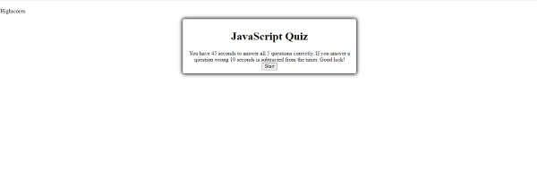
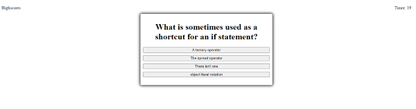

# JavaScript Quiz

- View the GitHub [repository](https://github.com/Jessica264365/Random-Password-Generator-HW3)
- View the live [website](https://jessica264365.github.io/Random-Password-Generator-HW3/)

## Table of Contents

- [About the Project](https://github.com/Jessica264365/Random-Password-Generator-HW3#about-the-project)
  - [Built With](https://github.com/Jessica264365/Random-Password-Generator-HW3#built-with)

* [Start Your Own](https://github.com/Jessica264365/Random-Password-Generator-HW3#start-your-own)
  - [Prerequisites](https://github.com/Jessica264365/Random-Password-Generator-HW3#prerequisites)
  - [Installation](https://github.com/Jessica264365/Random-Password-Generator-HW3#installation)

- [License](https://github.com/Jessica264365/Random-Password-Generator-HW3#license)
- [Roadmap](https://github.com/Jessica264365/Random-Password-Generator-HW3#roadmap)
- [Contribute](https://github.com/Jessica264365/Random-Password-Generator-HW3#contribute)
- [My Contact Information](https://github.com/Jessica264365/Random-Password-Generator-HW3#my-contact-information)

## About the Project

I was tasked with creating a JavaScript Quiz. It had to have at least 5 questions. When the start button is clicked the user is given a certain amount of time to answer all 5 questions. If a user answers a question incorrectly 10 seconds is deducted from the timer. If the timer runs out before all the questions are answered the user is prompted to start over. If the user makes it to the end of the quiz, they are prompted to input a name. The name is then saved with their time it took to complete the quiz in local storage. When the user clicks the "Highscore" link in the navigation bar, all the scores are presented. The user then has a button to click in order to return to the start of the quiz if they wish to retake it.

 

### Built With

I did not use any specific tool to create this quiz. It is just plain vanilla JavaScript.

## Start Your Own

To get a copy of this project on your local computer please follow these next steps.

### Prerequisites

Be familier with some JavaScript.

### Installation

1. Clone the repository

   git@github.com:Jessica264365/Web-APIs-Code-Quiz-HW4.git

## License

None

## Roadmap

This project does not currently have an open issues. Please check the [issues](https://github.com/Jessica264365/Web-APIs-Code-Quiz-HW4/issues) page on GitHub for any updates.

## Contribute

If you are interesting in contributing to this project please follow these steps:

1. Fork the project
2. Create your own branch
3. Commit your personal changes
4. Push to the branch
5. Do a pull request

## My Contact Information

Email: jwhitman135@outlook.com

GitHub Page: https://github.com/Jessica264365

Link to project: https://github.com/Jessica264365/Web-APIs-Code-Quiz-HW4
